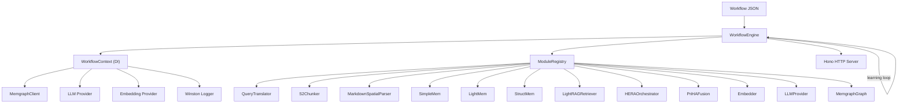

# MemFlow Architecture

> Self-Improving RAG & Lifelong Memory Workflow Engine

---

## Design Philosophy

MemFlow is **modular, typed, and self-improving**:

- Every major capability from 10+ research papers (2024–2026) is an independent, testable module.
- Modules communicate through a **typed shared data bus** (`WorkflowData`), not `Record<string, any>`.
- The **WorkflowEngine** reads a JSON file and executes stages with retry, validation, and an optional learning loop.
- **WorkflowContext** provides dependency injection — shared Memgraph client, cached LLM/Embedding providers with per-module overrides, and Winston structured logging.
- **Memgraph + MAGE** is the persistence layer for graphs, vectors, and memory units.
- S2Chunker extends LangChain's **real `TextSplitter`** class — drop-in compatible with any LCEL pipeline.
- All LLM prompts are externalised as **TOML files** (`src/prompts/`), with configurable temperature, token limits, and `{{variable}}` template rendering. This enables prompt tuning without code changes.

## High-Level Architecture



## Core Runtime

### WorkflowEngine (`core/WorkflowEngine.ts`)
1. Parse JSON config → validate with Zod
2. `initialize()` → create WorkflowContext, resolve modules, call `init()`
3. `run()` → execute DAG with retry, trace, and optional learning iterations
4. `shutdown()` → call `shutdown()` on all modules and context

Features:
- **Parallel DAG execution**: when `next` is an array, branches execute concurrently via `Promise.allSettled`. The `dependsOn` field gates execution until all listed dependencies complete. `maxConcurrency` in `globalConfig` limits parallel width.
- **Configurable conditional routing**: `next` can be `{ "metric>threshold": "stageId", "default": "fallback" }` with operators `>`, `>=`, `<`, `<=`, `==`, `!=`. Bare metric names default to `> 0.5` for backward compatibility.
- Exponential backoff retry per stage
- Learning loop with composite scoring
- State export as JSON

### WorkflowContext (`core/WorkflowContext.ts`)
DI container holding all shared runtime resources:
- **MemgraphClient** — singleton, parameterised Cypher only
- **LLM providers** — cached by `provider:model` key, per-module override
- **Embedding providers** — same caching strategy
- **Winston logger** — structured JSON logging
- **Trace accumulator** — per-stage timing and I/O summaries

### ModuleRegistry (`core/ModuleRegistry.ts`)
Singleton factory with lazy dynamic imports, instance caching by `module::stageId`, and runtime plugin registration.

## Module Deep Dive

### S2Chunker (`modules/chunking/S2Chunker.ts`)
- **Paper**: S2 Chunking (arXiv:2501.05485)
- Real spectral clustering: affinity matrix → normalised Laplacian → Jacobi eigensolver → eigengap heuristic for k → K-Means++ on eigenvectors
- Extends `TextSplitter` from `@langchain/textsplitters`
- L2-normalised embeddings, reading-order reconstruction
- **Deviation from paper**: combined weight formula uses configurable `alpha` parameter (default 0.5) instead of the paper's fixed average: `w = alpha * w_semantic + (1 - alpha) * w_spatial`. This allows tuning the spatial-vs-semantic balance per dataset.
- Companion: `MarkdownSpatialParser` (367L) converts Markdown → spatial elements

### Memory Pipeline (SimpleMem → LightMem → StructMem)
- **SimpleMem**: Semantic density gating (Φ_gate, configurable via `enableDensityGating`) + LLM de-linearisation (atomic fact extraction, coreference resolution) + online semantic synthesis (merge > 0.82 strictly greater than, not ≥) + sliding window grouping (overlapping windows for temporal context) + multi-view structured indexing (semantic/lexical/symbolic layers)
- **LightMem**: Three-tier hierarchical memory (Sensory → STM → LTM). Sensory buffer filters by novelty gating (cosine threshold). **Hybrid B1∩B2 topic segmentation** (paper §3.1): B1 = attention-based local maxima in embedding distance; B2 = similarity drops below threshold τ; final boundaries = B1∩B2 with B2 fallback. STM accumulates topic-segmented units. **LTM soft-update** (paper §3.3): Q(ei) = Topk(ej, sim(vi,vj)) | tj ≥ ti — timestamp-constrained similarity updates existing entries in-place. Parallel sleep-time consolidation via LLM.
- **StructMem**: Dual-perspective event binding + temporal anchoring + **full cross-event consolidation** (paper §3.2): Cbuf = Sortτ{x ∈ Mbuffer} → aggregated query → retrieve seed entries from consolidated history → LLM synthesizes cross-event connections. Fallback: pairwise cosine binding. Persists to Memgraph.

### LightRAGRetriever (`modules/retrieval/LightRAGRetrieverModule.ts`)
- **Paper**: LightRAG (arXiv:2410.05779)
- Hybrid: vector search + graph traversal + keyword fulltext
- Intent-aware planning: LLM classifies query type → adjusts search scope
- Pyramid progressive expansion: budget-gated, with graph neighbour fallback on low recall
- Note: incremental graph updates are handled by `MemgraphGraph` module, not the retriever

### HERAOrchestrator (`modules/agents/HERAOrchestratorModule.ts`)
- **Paper**: HERA (arXiv:2604.00901)
- Experience Library: Profile-Insight-Utility tuples, reinforced via GRPO-style group comparison
- LLM-generated agent topologies (retriever/reasoner/critic/synthesizer/verifier/decomposer)
- Multi-agent trajectory execution with accumulated context
- **RoPE (Role-aware Prompt Evolution, §3.4)**: Tracks per-agent failed trajectories. Contrastive analysis extracts operational rules (short-term corrections) + behavioral principles (long-term strategies). Evolved prompts are consolidated and used in subsequent trajectory executions.
- **Topology Mutation (§3.5)**: When trajectories consistently fail below `mutationThreshold` for `mutationTriggerCount` consecutive runs, the orchestrator replaces failing agents or augments the topology with alternatives. **Mutations are persisted structurally** — the `mutatedTopology` state ensures subsequent `generatePlan()` calls incorporate previous mutations.
- Agent role prompts (retriever, reasoner, critic, synthesizer, verifier, decomposer, query_decomposer, answer_generator, query_rewriter, evidence_selector, context_validator, reflect_agent, conclude_agent) are loaded from TOML files in `src/prompts/hera/roles/`.

### PriHAFusion (`modules/generation/PriHAFusionModule.ts`)
- **Paper**: PriHA (arXiv:2604.14215)
- Automated multi-query clarification (PHC-O pattern): iteratively decomposes fuzzy queries into specific sub-queries (up to `maxClarificationDepth` passes), dual-source fusion (guidelines vs dynamic context), hallucination validation, inline citations

### QueryTranslator (`modules/query/QueryTranslatorModule.ts`)
- HyDE, Multi-Query, Step-Back, Query Rewriting, Intent Clarification
- Real LLM calls with string-template fallbacks

## Data Model in Memgraph

- **:Chunk** — S2 output (text, embedding, source)
- **:MemoryUnit** — atomic facts/events/summaries (content, embedding, type, timestamp, confidence)
- **:Entity** — LLM-extracted entities with type, description, profileSummary, keyThemes
- **:Element** — raw layout elements from document parser
- **Edges**: `SPATIAL_NEAR`, `MEMORY_RELATION`, `MENTIONS`, `RELATES_TO` (typed relationships with description + keywords)
- **Indexes**: Vector on `Chunk.embedding`, `MemoryUnit.embedding`

### MemgraphGraph Module
Implements the LightRAG paper's graph-based text indexing (§3.1):
1. **Entity & Relationship Extraction**: LLM-driven, prompt from `graph/entity_extraction.toml`
2. **Entity Profiling**: key-value pair generation via `graph/entity_profiling.toml`
3. **Deduplication**: LLM groups equivalent entity names via `graph/deduplication.toml`
4. **Community Detection**: MAGE Leiden algorithm on entity relation graph

## HTTP API (Hono)

| Endpoint | Method | Description |
|---|---|---|
| `/health` | GET | Service health + registered modules |
| `/modules` | GET | List available modules |
| `/workflow/run` | POST | Execute workflow from JSON config + input |

## Type Safety

The `WorkflowData` interface provides typed fields for all inter-module data:
- `query`, `expandedQueries` — query stage
- `documents`, `chunks`, `embeddings` — chunking/embedding stage
- `memoryUnits` — memory stage
- `retrievalResult` — retrieval stage
- `agentResult`, `finalAnswer`, `sources`, `confidence` — generation stage
- `metrics` — accumulated across all stages
- `[key: string]: unknown` — escape hatch for custom extensions

## Error Handling

7 typed error classes: `MemFlowError`, `WorkflowStageError`, `WorkflowConfigError`, `WorkflowDAGError`, `ModuleNotFoundError`, `ProviderError`, `MemgraphError`.

## Security & Production Notes

- No external code execution in workflow JSON
- All Cypher query values use parameterised bindings (no string interpolation of user data); label/property identifiers are validated against a strict `^[A-Za-z_][A-Za-z0-9_]{0,63}$` allowlist before interpolation (required because Cypher does not support parameterised labels). DDL statements (CREATE INDEX) also interpolate `dimensions` which is validated as a safe positive integer (1–65536) via `assertSafeDimension()`.
- API keys via env only
- Memgraph auth + network isolation recommended in prod
- CORS middleware on HTTP server
- **Dual-runtime**: Server auto-detects Bun vs Node.js via `globalThis.Bun`. Bun uses native `Bun.serve()`, Node.js uses `@hono/node-server` (listed in dependencies) with raw `node:http` fallback.

## Prompt System (TOML)

All LLM prompts are externalised in `src/prompts/` as TOML files:

```
src/prompts/
  simplemem/     extraction.toml, density_gating.toml
  lightmem/      consolidation.toml
  structmem/     dual_perspective.toml, consolidation_synthesis.toml
  retrieval/     intent_inference.toml
  hera/          plan_generation.toml, reflection.toml, reflection_single.toml, synthesis.toml, rope_evolution.toml, topology_mutation.toml
  hera/roles/    13 role-specific agent prompts
  priha/         clarification.toml, generation.toml, refinement.toml, validation.toml
  query/         hyde.toml, multi_query.toml, step_back.toml, query_rewriting.toml, intent_clarification.toml
  graph/         entity_extraction.toml, entity_profiling.toml, deduplication.toml
```

Each TOML file contains `[meta]` (name, version), `[config]` (temperature, max_tokens, custom knobs), and `[[messages]]` with `{{variable}}` template placeholders. Loaded via `src/utils/promptLoader.ts`.

## Workflow Examples

Three example workflows in `src/workflows/examples/`:
- `rag-memory-pipeline.json` — Full 10-stage pipeline: translate → parse → chunk → embed → graph → SimpleMem → LightMem → StructMem → retrieve → fuse
- `quick-qa.json` — Minimal 4-stage QA: translate → embed → retrieve → fuse
- `multi-agent-research.json` — Advanced: parallel retrieval branches → HERA with learning + RoPE + topology mutation

---

*Every module is traceable to a specific paper. See [PAPERS.md](docs/PAPERS.md) for the full reference list.*