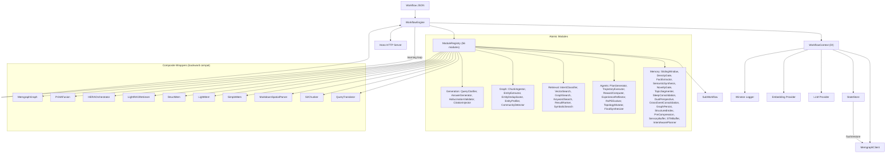

# MemFlow Architecture

> Self-Improving RAG & Lifelong Memory Workflow Engine — Composable Atomic Modules with Sub-Workflow Nesting

---

## Design Philosophy

MemFlow is **composable, typed, and self-improving**:

- Every research paper capability is decomposed into **atomic modules** — small, focused units that do exactly one thing.
- Atomic modules are composed into **sub-workflows** — JSON-described DAGs that replicate paper-aligned pipelines.
- Sub-workflows are callable from parent workflows via the **`SubWorkflow`** engine module, enabling workflows-within-workflows with shared context.
- Modules communicate through a **typed shared data bus** (`WorkflowData`), not `Record<string, any>`.
- The **WorkflowEngine** reads a JSON file and executes stages with retry, parallel branches, conditional routing, and optional learning loops.
- **WorkflowContext** provides dependency injection — shared Memgraph client, StateStore, cached LLM/Embedding providers with per-module overrides, and Winston structured logging.
- **StateStore** provides Memgraph-backed persistent state with in-memory LRU cache for crash recovery of long-running workflows.
- **Memgraph + MAGE** is the persistence layer for graphs, vectors, memory units, and module state.
- S2Chunker extends LangChain's **real `TextSplitter`** class — drop-in compatible with any LCEL pipeline.
- All LLM prompts are externalised as **TOML files** (`src/prompts/`), with configurable temperature, token limits, and `{{variable}}` template rendering.
- Original monolithic modules remain as **backward-compatible wrappers** — existing workflows continue to work unchanged.

## High-Level Architecture



## Core Runtime

### WorkflowEngine (`core/WorkflowEngine.ts`)
1. Parse JSON config → validate with Zod
2. `initialize()` → create WorkflowContext, **validate all module configs** (fail-fast), resolve modules, call `init()`
3. `initializeWithContext(parentCtx)` → reuse existing context (for sub-workflows), **validate configs**
4. `run()` → execute DAG with retry, trace, and optional learning iterations
5. `shutdown()` → call `shutdown()` on all modules and context

Features:
- **Parallel DAG execution**: when `next` is an array, branches execute concurrently via `Promise.allSettled`. The `dependsOn` field gates execution until all listed dependencies complete. `maxConcurrency` in `globalConfig` limits parallel width.
- **Configurable conditional routing**: `next` can be `{ "metric>threshold": "stageId", "default": "fallback" }` with operators `>`, `>=`, `<`, `<=`, `==`, `!=`. Bare metric names default to `> 0.5` for backward compatibility.
- **Sub-workflow nesting**: stages with `module: "SubWorkflow"` instantiate a child WorkflowEngine with shared context, controlled by `workflow`/`workflowRef`, `inputMap`, and `outputMap`.
- **Config validation at load time**: `validateModuleConfigs()` resolves every module and calls `getConfigSchema().parse()` during `initialize()`, surfacing all Zod validation errors as a single `WorkflowConfigError` before execution begins — prevents failures minutes into long-running pipelines.
- Exponential backoff retry per stage
- Learning loop with composite scoring
- State export as JSON

### WorkflowContext (`core/WorkflowContext.ts`)
DI container holding all shared runtime resources:
- **MemgraphClient** — singleton, parameterised Cypher only
- **StateStore** — Memgraph-backed persistent state with in-memory LRU cache
- **LLM providers** — cached by `provider:model` key, per-module override
- **Embedding providers** — same caching strategy
- **Winston logger** — structured JSON logging
- **Trace accumulator** — per-stage timing and I/O summaries

### MemgraphClient (`providers/MemgraphClient.ts`)
Singleton Cypher query client with parameterised-only bindings:
- **`query(cypher, params)`** — single parameterised query execution
- **`batchQuery(cypher, items, additionalParams?)`** — `UNWIND $items AS item` batch helper that reduces N round-trips to 1. Used by `ChunkIngestor`, `CommunityDetector`, `ParentChildChunker`, `CitationInjector`, and `persistMemoryUnits()`.
- **`withTransaction(fn, mode)`** — managed read/write transactions
- **`getQueryCount()` / `resetQueryCount()`** — telemetry counters for per-stage Cypher query tracking
- **Identifier validation** — strict `^[A-Za-z_][A-Za-z0-9_]{0,63}$` allowlist for labels/properties

### StateStore (`core/StateStore.ts`)
Persistent module state for stateful components (LightMem tiers, HERA experience library):
- **In-memory LRU cache** for zero-latency hot reads within a run
- **Memgraph persistence** via `:ModuleState` nodes for crash recovery
- **Auto-flush** every 5s for dirty entries
- **`restore()`** rehydrates all state from Memgraph on workflow resume
- **Scoped** by `workflowId + moduleKey` for isolation

### ModuleRegistry (`core/ModuleRegistry.ts`)
Singleton factory with lazy dynamic imports, instance caching by `module::stageId`, `clearInstances()` for validation cleanup, and runtime plugin registration. Registers **56 built-in modules**: 7 composite wrappers (thin delegation layers), 38 atomic modules, 3 standalone modules, 2 provider modules, 2 core modules (SubWorkflow + AutonomousLoop), and 4 monolithic compatibility wrappers.

### SubWorkflowModule (`modules/core/SubWorkflowModule.ts`)
Enables workflows-within-workflows:
- Loads child workflow from `workflow` (inline JSON) or `workflowRef` (file path)
- Maps data between parent and child via `inputMap`/`outputMap`
- Shares parent's WorkflowContext (no duplicate connections)
- Recursion depth guard (default max 5)

### AutonomousLoopModule (`modules/core/AutonomousLoopModule.ts`)
Meta-module that wraps any sub-workflow in an iterative diagnosis → mutation → re-execution loop (OMNI-SIMPLEMEM §3). Uses `ModuleRegistry.resolve()` to instantiate child workflows (decoupled from direct `SubWorkflowModule` import).

## Module Deep Dive

> **Full per-module reference** (input/output fingerprints, config schemas, behavioral descriptions, paper traceability): **[docs/modules/MODULES.md](docs/modules/MODULES.md)**

### Pipeline Architecture Summary

| Pipeline | Atomic Modules | Sub-Workflow | Paper |
|---|---|---|---|
| **SimpleMem Write** | SlidingWindow → DensityGate → FactExtractor → SemanticSynthesis → StructuredIndex | `simplemem-pipeline.json` | SimpleMem §2 |
| **SimpleMem Read** | IntentAwarePlanner → [VectorSearch ∥ KeywordSearch ∥ SymbolicSearch] → ResultRanker | `simplemem-retrieval.json` | SimpleMem §2.3 |
| **LightMem** | PreCompression → SensoryBuffer → [cond] → NoveltyGate → TopicSegmenter → STMBuffer → SleepConsolidation | `lightmem-pipeline.json` | LightMem §3.1–3.3 |
| **StructMem** | DualPerspective → CrossEventConsolidation → GraphPersist | `structmem-pipeline.json` | StructMem §3 |
| **HERA Agents** | PlanGenerator → TrajectoryExecutor → RewardComputer → ExperienceReflector → [RoPEEvolver] → [TopologyMutator] → FinalSynthesizer | `hera-orchestration.json` | HERA |
| **Hybrid Retrieval** | IntentClassifier → [VectorSearch ∥ GraphSearch ∥ KeywordSearch] → ResultRanker | `hybrid-retrieval.json` | LightRAG |
| **Graph Indexing** | ChunkIngestor → EntityExtractor → EntityDeduplicator → EntityProfiler → CommunityDetector | `graph-indexing.json` | LightRAG §3.1 |
| **PriHA Generation** | QueryClarifier → AnswerGenerator → HallucinationValidator → CitationInjector | `priha-fusion.json` | PriHA |

### Key Algorithmic Behaviors

- **SleepConsolidation**: Per-entry update queues `Q(eᵢ) = Topk({eⱼ, sim(vᵢ, vⱼ)} | tⱼ ≥ tᵢ)` with parallel `Promise.allSettled` execution (LightMem §3.3). **Configurable `similarityFunction`** (v0.4.0).
- **RoPEEvolver**: Prompt consolidation via projection ΠC — merges, not overwrites. Integrates per-agent failure buffers from `HERAOrchestrator` (HERA §3.4)
- **KeywordSearch**: Dual mode — basic Memgraph text index or MAGE BM25 with configurable k1/b parameters
- **CommunityDetector**: Louvain (`community_detection.get()`) or Leiden (`leiden_community_detection.get()`) with LLM community summaries persisted as `:Community` nodes. Uses `batchQuery()` for N→1 label writes.
- **CrossEventConsolidation**: Time-window–bounded seed retrieval with aggregated centroid query (StructMem §3.2). **Configurable `similarityFunction`** (v0.4.0).
- **EntityDeduplicator**: `checkExistingGraph` mode queries Memgraph before dedup for true incremental graph updates
- **CitationInjector**: Persists `:Citation` nodes with `:CITES` edges for traceable source attribution. Uses `batchQuery()` UNWIND for N+1→2 round-trip reduction.
- **TopicSegmenter**: Hybrid B1∩B2 boundary detection with configurable similarity function (`cosine`, `euclidean`, `dotProduct`). Derives `topicLabel` for each segment.
- **NoveltyGate**: Cosine-based novelty filtering with configurable `similarityFunction` parameter.
- **SemanticSynthesis**: LLM-based session-scoped consolidation with configurable `similarityFunction` for cluster detection.
- **GraphSearch**: Entity-centric graph traversal. **Community-aware mode** (v0.4.0): when `communityScope: true` and `searchScope` is high-level, queries `:Community` summaries for theme-based retrieval.
- **FactExtractor**: Populates `modelId` and `providerId` from `WorkflowContext.globalConfig` for provenance tracking. Emits telemetry counters (`embeddingCalls`, `tokenUsage`).
- **ChunkIngestor**: Uses `batchQuery()` UNWIND for N→1 batch ingestion. Emits `memgraphQueries` telemetry.

### Standalone Modules

- **S2Chunker**: Real spectral clustering on spatial+semantic affinity (extends LangChain `TextSplitter`). Companion: `MarkdownSpatialParser`.
- **QueryTranslator**: HyDE, Multi-Query, Step-Back, Query Rewriting, Intent Clarification — real LLM calls with string-template fallbacks.
- **ParentChildChunker**: Two-tier chunking (small children for precision, large parents for context) with `:BELONGS_TO` graph edges. Uses `batchQuery()` for N→2 batch persistence.
- **AutonomousLoop**: Meta-module wrapping any sub-workflow in an iterative diagnosis → mutation → re-execution loop (OMNI-SIMPLEMEM §3). Decoupled from `SubWorkflowModule` — uses `ModuleRegistry.resolve()`.

## Data Model in Memgraph

- **:Chunk** — S2 output (text, embedding, source)
- **:MemoryUnit** — atomic facts/events/summaries (content, embedding, type, timestamp, confidence)
- **:Entity** — LLM-extracted entities with type, description, profileSummary, keyThemes, `communityId`
- **:Community** — Community summaries from MAGE detection (id, summary, nodeCount, members)
- **:Element** — raw layout elements from document parser
- **:ParentChunk** — Large context chunks for PriHA parent-child retrieval
- **:ChildChunk** — Small precision chunks for PriHA parent-child retrieval
- **:Answer** — Generated answers for citation tracking
- **:Citation** — Traceable source URLs with title, accessedAt, verified status
- **:ModuleState** — persistent module state (workflowId, moduleKey, value JSON, updatedAt)
- **Edges**: `SPATIAL_NEAR`, `MEMORY_RELATION`, `MENTIONS`, `RELATES_TO` (typed relationships with description + keywords), `BELONGS_TO` (child→parent chunks), `CITES` (answer→citation)
- **Indexes**: Vector on `Chunk.embedding`, `MemoryUnit.embedding`

## HTTP API (Hono)

| Endpoint | Method | Description |
|---|---|---|
| `/health` | GET | Service health + registered modules |
| `/modules` | GET | List available modules |
| `/workflow/run` | POST | Execute workflow from JSON config + input. Returns aggregated `telemetry` (tokenUsage, memgraphQueries, embeddingCalls). |
| `/workflow/run/stream` | POST | Execute workflow with SSE streaming (Improvement #9). Returns `text/event-stream` with `StreamEvent` objects. |
| `/prompts/validate` | GET | Validate all TOML prompt references (Improvement #8) |
| `/prompts/reload` | POST | Manually invalidate the TOML prompt cache for hot-reload (Improvement #15) |

## Type Safety

The `WorkflowData` interface provides typed fields for all inter-module data:

| Stage | Fields |
|---|---|
| Query | `query`, `expandedQueries`, `clarifications` |
| Chunking | `documents`, `chunks`, `markdown` |
| Embedding | `embeddings` |
| Memory pipeline | `memoryUnits`, `windowedChunks`, `filteredChunks`, `topicSegments` |
| Graph | `graphContext`, `entities`, `relationships` |
| Retrieval | `retrievalResult`, `candidates`, `searchScope` |
| Agents | `agentResult`, `agentPlan`, `trajectory`, `insights` |
| Generation | `finalAnswer`, `sources`, `confidence` |
| Telemetry | `metrics.tokenUsage`, `metrics.memgraphQueries`, `metrics.embeddingCalls` |
| Meta | `metrics`, `[key: string]: unknown` (escape hatch) |

## Error Handling

7 typed error classes: `MemFlowError`, `WorkflowStageError`, `WorkflowConfigError`, `WorkflowDAGError`, `ModuleNotFoundError`, `ProviderError`, `MemgraphError`.

All module error boundaries use structured logging instead of bare `catch {}` blocks. Errors include the originating module name, error message, and relevant context (node IDs, query details, batch sizes) for actionable debugging.

## Security & Production Notes

- No external code execution in workflow JSON
- All Cypher query values use parameterised bindings (no string interpolation of user data); label/property identifiers are validated against a strict `^[A-Za-z_][A-Za-z0-9_]{0,63}$` allowlist before interpolation (required because Cypher does not support parameterised labels). DDL statements (CREATE INDEX) also interpolate `dimensions` which is validated as a safe positive integer (1–65536) via `assertSafeDimension()`.
- API keys via env only
- Memgraph auth + network isolation recommended in prod
- CORS middleware on HTTP server
- **Dual-runtime**: Server auto-detects Bun vs Node.js via `globalThis.Bun`. Bun uses native `Bun.serve()`, Node.js uses `@hono/node-server` (listed in dependencies) with raw `node:http` fallback.

## Prompt System (TOML)

All LLM prompts are externalised in `src/prompts/` as TOML files:

```
src/prompts/
  simplemem/     extraction.toml, density_gating.toml, synthesis.toml, intent_aware_planning.toml
  lightmem/      consolidation.toml, pre_compression.toml
  structmem/     dual_perspective.toml, consolidation_synthesis.toml
  retrieval/     intent_inference.toml
  hera/          plan_generation.toml, reflection.toml, reflection_single.toml, synthesis.toml, rope_evolution.toml, topology_mutation.toml
  hera/roles/    13 role-specific agent prompts
  priha/         clarification.toml, generation.toml, refinement.toml, validation.toml
  query/         hyde.toml, multi_query.toml, step_back.toml, query_rewriting.toml, intent_clarification.toml
  graph/         entity_extraction.toml, entity_profiling.toml, deduplication.toml
```

Each TOML file contains `[meta]` (name, version), `[config]` (temperature, max_tokens, custom knobs), and `[[messages]]` with `{{variable}}` template placeholders. Loaded via `src/utils/promptLoader.ts`.

### Startup Validation (Improvement #8)

`WorkflowContext.create()` calls `validateAllPrompts()` which checks all 25+ known TOML prompt references against the file system. Missing or malformed prompts are logged as warnings for fail-fast error surfacing.

### Hot-Reload (Improvement #15)

`startPromptWatcher()` monitors `src/prompts/` via `fs.watch` with a 300ms debounce. When a TOML file changes on disk, the cached version is automatically invalidated. The `POST /prompts/reload` endpoint provides manual cache invalidation for CI/CD scenarios.

## Workflow Versioning (Improvement #16)

Workflow JSON configs include a `"version"` field (defaults to `"1.0"` for backward compatibility). The engine validates versions during construction:

| Version | Status | Behavior |
|---|---|---|
| `1.0`, `1.1` | Current | Accepted silently |
| `0.1`, `0.2` | Deprecated | Accepted with warning — migration recommended |
| Other | Unsupported | Rejected with `WorkflowConfigError` |

## SSE Streaming (Improvement #9)

### Design Principle

Streaming is **fully additive and non-breaking**. The existing `run()` path, `process()` method, and `POST /workflow/run` endpoint are completely unmodified. Streaming is a parallel execution path.

### Architecture

The `WorkflowEventEmitter` (a typed wrapper around Node.js's native `EventEmitter`) is the **single source of truth** for all streaming events. Events are emitted via the emitter and optionally yielded via an AsyncGenerator for backward compatibility:

```
WorkflowEngine
    │
    ├── runStream() ────── AsyncGenerator<StreamEvent> ──► SSE endpoint (Hono)
    │       │
    │       └── emitter.emit(event)  ←── dual-emission
    │
    └── engine.events ─── WorkflowEventEmitter
            │
            ├── .on('stage:complete', handler)  ←── typed subscription
            ├── .on('stage:progress', handler)  ←── token-level
            ├── .on('*', handler)               ←── wildcard (all events)
            └── .toAsyncGenerator()             ←── alternative to runStream()
```

### WorkflowEventEmitter

Wraps Node.js `EventEmitter` with typed `on()`/`once()`/`off()` for each `StreamEvent` type. Supports a wildcard `*` channel that receives ALL events. Provides `toAsyncGenerator()` for consumers preferring the iterator pattern.

```typescript
// Typed subscription — TypeScript narrows the event type
engine.events.on('stage:complete', (event) => {
  console.log(event.durationMs);  // typed as StreamEventStageComplete
});

// Wildcard — receive all events
engine.events.on('*', (event) => {
  logger.info(`[${event.type}]`, event);
});

// AsyncGenerator bridge
for await (const event of engine.events.toAsyncGenerator()) {
  // same as consuming runStream()
}
```

### StreamEvent Protocol

7 discriminated event types (field: `type`):

| Event | When | Key Fields |
|---|---|---|
| `workflow:start` | Workflow begins | `workflowId`, `stages[]` |
| `stage:start` | Stage about to execute | `stageId`, `module`, `progress` |
| `stage:progress` | LLM token generated | `stageId`, `token`, `tokenIndex` |
| `stage:complete` | Stage finished | `stageId`, `durationMs`, `preview` |
| `stage:error` | Stage failed | `stageId`, `error`, `willRetry` |
| `workflow:complete` | Workflow finished | `totalDurationMs`, `finalAnswer` |
| `workflow:error` | Workflow-level failure | `error`, `stage` |

### StreamableModule Interface

Modules can opt into token-level streaming by implementing `processStream()`:

```typescript
interface StreamableModule<T> extends BaseModule<T> {
  processStream(
    input: ModuleInput<T>,
    context: unknown,
  ): AsyncGenerator<StreamEvent, ModuleOutput, undefined>;
}
```

**Currently streaming**: `AnswerGenerator`, `FinalSynthesizer` (via LangChain `.stream()`)

### Client-Side Usage

```javascript
const response = await fetch('/workflow/run/stream', {
  method: 'POST',
  headers: { 'Content-Type': 'application/json' },
  body: JSON.stringify({ workflow, input })
});

const reader = response.body.getReader();
const decoder = new TextDecoder();

while (true) {
  const { done, value } = await reader.read();
  if (done) break;
  // Parse SSE events from the chunk
  const text = decoder.decode(value);
  // Each event has: event: <type>\ndata: <json>\n\n
}
```

## Sub-Workflow System

Sub-workflows enable workflows-within-workflows. Any stage can delegate to a child workflow via the `SubWorkflow` module:

```json
{
  "id": "retrieve",
  "module": "SubWorkflow",
  "workflowRef": "src/workflows/sub/hybrid-retrieval.json",
  "inputMap": { "query": "query" },
  "outputMap": { "retrievalResult": "retrievalResult" },
  "next": "generate"
}
```

Pre-built sub-workflows in `src/workflows/sub/`:

| File | Stages | Key Feature |
|---|---|---|
| `simplemem-pipeline.json` | Window → Gate → Extract → Synthesize → Index | Full SimpleMem §2 write path |
| `simplemem-retrieval.json` | Plan → [Sem ∥ Lex ∥ Sym] → Rank | SimpleMem §2.3 multi-view retrieval |
| `lightmem-pipeline.json` | PreCompress → SensoryBuffer → [cond] → Novelty → Segment → STMBuffer → Consolidate | Full LightMem 3-tier (Light₁+Light₂+Light₃) |
| `structmem-pipeline.json` | DualPersp → Consolidate → Persist | Cbuf→seed→LLM synthesis |
| `hera-orchestration.json` | Plan → Execute → Reward → Reflect → [RoPE] → [Mutate] → Synthesize | Conditional GRPO branches |
| `hybrid-retrieval.json` | Intent → [Vector ∥ Graph ∥ Keyword] → Rank | 3-way parallel fan-out |
| `graph-indexing.json` | Ingest → Extract → Dedup → Profile → Community | LightRAG §3.1 |
| `priha-fusion.json` | Clarify → Generate → Validate → Cite | Full PriHA pipeline |

## Workflow Examples

Three top-level example workflows in `src/workflows/examples/`:
- `rag-memory-pipeline.json` — Full 10-stage pipeline: translate → parse → chunk → embed → graph → SimpleMem → LightMem → StructMem → retrieve → fuse
- `quick-qa.json` — Minimal 4-stage QA: translate → embed → retrieve → fuse
- `multi-agent-research.json` — Advanced: parallel retrieval branches → HERA with learning + RoPE + topology mutation

## File Structure

```
src/
  core/
    WorkflowEngine.ts         — DAG executor with parallel, retry, learning loops, sub-workflow support
    WorkflowContext.ts         — DI container (Memgraph, LLM, Embeddings, StateStore, Logger)
    ModuleRegistry.ts          — Lazy-loading singleton with 56 registered modules
    StateStore.ts              — Memgraph-backed persistent state with LRU cache
    types.ts                   — All interfaces (WorkflowData, BaseModule, etc.)
    errors.ts                  — 7 typed error classes
  modules/
    core/                      SubWorkflowModule, AutonomousLoopModule
    chunking/                  S2ChunkerModule, MarkdownSpatialParserModule, ParentChildChunkerModule
    memory/                    SimpleMemModule, LightMemModule, StructMemModule,
                               SlidingWindowModule, DensityGateModule, FactExtractorModule,
                               SemanticSynthesisModule, NoveltyGateModule, TopicSegmenterModule,
                               SleepConsolidationModule, DualPerspectiveModule,
                               CrossEventConsolidationModule, GraphPersistModule,
                               StructuredIndexModule, PreCompressionModule, SensoryBufferModule,
                               STMBufferModule, IntentAwarePlannerModule, AttentionScoreModule
    agents/                    HERAOrchestratorModule, PlanGeneratorModule, TrajectoryExecutorModule,
                               RewardComputerModule, ExperienceReflectorModule,
                               RoPEEvolverModule, TopologyMutatorModule, FinalSynthesizerModule
    retrieval/                 LightRAGRetrieverModule, IntentClassifierModule, VectorSearchModule,
                               GraphSearchModule, KeywordSearchModule, ResultRankerModule,
                               SymbolicSearchModule, SetUnionMergerModule, DualLevelRouterModule
    graph/                     MemgraphGraphModule, ChunkIngestorModule, EntityExtractorModule,
                               EntityDeduplicatorModule, EntityProfilerModule, CommunityDetectorModule
    generation/                PriHAFusionModule, QueryClarifierModule, AnswerGeneratorModule,
                               HallucinationValidatorModule, CitationInjectorModule,
                               WebSearchAgentModule (stub)
    query/                     QueryTranslatorModule
    providers/                 EmbedderModule, LLMProviderModule
  workflows/
    examples/                  rag-memory-pipeline.json, quick-qa.json, multi-agent-research.json
    sub/                       simplemem-pipeline.json, simplemem-retrieval.json,
                               lightmem-pipeline.json, structmem-pipeline.json,
                               hera-orchestration.json, hybrid-retrieval.json, graph-indexing.json,
                               priha-fusion.json
  prompts/                     TOML prompt templates (see Prompt System section)
  providers/                   LLMProvider.ts, EmbeddingProvider.ts, MemgraphClient.ts (batchQuery, query counters)
  server/                      Hono HTTP server (dual-runtime Bun/Node.js, telemetry aggregation)
  utils/                       promptLoader.ts, similarity.ts (cosine/euclidean/dotProduct strategy), tokens.ts
```

---

*Every module is traceable to a specific paper. See [PAPERS.md](docs/PAPERS.md) for the full reference list.*