# MemFlow Architecture

> Self-Improving RAG & Lifelong Memory Workflow Engine — Composable Atomic Modules with Sub-Workflow Nesting

---

## Design Philosophy

MemFlow is **composable, typed, and self-improving**:

- Every research paper capability is decomposed into **atomic modules** — small, focused units that do exactly one thing.
- Atomic modules are composed into **sub-workflows** — JSON-described DAGs that replicate paper-aligned pipelines.
- Sub-workflows are callable from parent workflows via the **`SubWorkflow`** engine module, enabling workflows-within-workflows with shared context.
- Modules communicate through a **typed shared data bus** (`WorkflowData`), not `Record<string, any>`.
- The **WorkflowEngine** reads a JSON file and executes stages with retry, parallel branches, conditional routing, and optional learning loops.
- **WorkflowContext** provides dependency injection — shared Memgraph client, StateStore, cached LLM/Embedding providers with per-module overrides, and Winston structured logging.
- **StateStore** provides Memgraph-backed persistent state with in-memory LRU cache for crash recovery of long-running workflows.
- **Memgraph + MAGE** is the persistence layer for graphs, vectors, memory units, and module state.
- S2Chunker extends LangChain's **real `TextSplitter`** class — drop-in compatible with any LCEL pipeline.
- All LLM prompts are externalised as **TOML files** (`src/prompts/`), with configurable temperature, token limits, and `{{variable}}` template rendering.
- Original monolithic modules remain as **backward-compatible wrappers** — existing workflows continue to work unchanged.

## High-Level Architecture

```mermaid
graph TD
    JSON["Workflow JSON"] --> WE["WorkflowEngine"]
    WE --> CTX["WorkflowContext (DI)"]
    CTX --> MG["MemgraphClient"]
    CTX --> SS["StateStore"]
    CTX --> LLM["LLM Provider"]
    CTX --> EMB["Embedding Provider"]
    CTX --> LOG["Winston Logger"]

    WE --> MR["ModuleRegistry (80 modules)"]
    WE --> EE["WorkflowEventEmitter"]
    EE --> METRICS["Prometheus Metrics"]
    EE --> SSE["SSE Endpoint"]

    MR --> SUB["SubWorkflow"]

    subgraph "Atomic Modules"
        MR --> M_MEM["Memory (16 atomic)"]
        MR --> M_AGT["Agents (7 atomic)"]
        MR --> M_RET["Retrieval (8 atomic)"]
        MR --> M_GRF["Graph (5 atomic)"]
        MR --> M_GEN["Generation (6 atomic)"]
    end

    subgraph "Composite Wrappers"
        MR --> SM["SimpleMem"]
        MR --> LM["LightMem"]
        MR --> STM["StructMem"]
        MR --> LR["LightRAGRetriever"]
        MR --> HERA["HERAOrchestrator"]
        MR --> PH["PriHAFusion"]
        MR --> MGMOD["MemgraphGraph"]
    end

    subgraph "GMPL Pattern Layer"
        MR --> DEBATE["DebateModule"]
        MR --> JUDGE["ConsensusJudge"]
        MR --> CLARIFY["MultiTurnClarifier"]
        MR --> PARALLEL["ParallelDispatcher"]
        MR --> OUTCOME["OutcomeMemory"]
        MR --> PEERREV["PeerReviewModule"]
        MR --> REDTEAM["RedTeamModule"]
        MR --> DELPHI["DelphiPanelModule"]
        GMPL_PR["PatternRegistry (6 patterns)"] --> DEBATE
        GMPL_PR --> CLARIFY
        GMPL_PR --> PARALLEL
        GMPL_PR --> PEERREV
        GMPL_PR --> REDTEAM
        GMPL_PR --> DELPHI
        GMPL_RR["RoleRegistry"] --> DEBATE
        GMPL_RR --> PARALLEL
        GMPL_DR["DomainRegistry"] -.-> GMPL_PR
        GMPL_PC["PatternComposer"] -.-> GMPL_PR
    end

    subgraph "Self-Evolution Layer"
        MR --> EVO_DS["SLMDatasetExporter"]
        MR --> EVO_TC["TraceCluster"]
        MR --> EVO_SM_EVO["SkillMerge"]
        MR --> EVO_SI["SkillInjector"]
        MR --> EVO_T2S["Trace2Skill"]
        MR --> EVO_HE["HarnessEvolver"]
        MR --> EVO_IC["IntentCompiler"]
        MR --> EVO_SBE["SkillBasisExtractor"]
        MR --> EVO_SGA["SkillGapAnalyzer"]
    end

    WE -->|"learning loop"| WE
    WE --> API["Hono HTTP Server"]
    API --> MCP["MCP Server"]
    API --> ACP["ACP Server"]
    API --> REST["REST API /api/v1"]

    SS -->|"flush/restore"| MG
```



## Core Runtime

### WorkflowEngine (`core/WorkflowEngine.ts`)
1. Parse JSON config → validate with Zod
2. `initialize()` → create WorkflowContext, **validate all module configs** (fail-fast), resolve modules, call `init()`
3. `initializeWithContext(parentCtx)` → reuse existing context (for sub-workflows), **validate configs**
4. `run()` → execute DAG with retry, trace, and optional learning iterations
5. `runStream()` → execute DAG with SSE event emission via `WorkflowEventEmitter`
6. `shutdown()` → call `shutdown()` on all modules and context

Features:
- **Parallel DAG execution**: when `next` is an array, branches execute concurrently via `Promise.allSettled`. The `dependsOn` field gates execution until all listed dependencies complete. `maxConcurrency` in `globalConfig` limits parallel width.
- **Configurable conditional routing**: `next` can be `{ "metric>threshold": "stageId", "default": "fallback" }` with operators `>`, `>=`, `<`, `<=`, `==`, `!=`. Bare metric names default to `> 0.5` for backward compatibility.
- **Sub-workflow nesting**: stages with `module: "SubWorkflow"` instantiate a child WorkflowEngine with shared context, controlled by `workflow`/`workflowRef`, `inputMap`, and `outputMap`.
- **Stage config overrides**: the `_stageConfigs` mechanism allows composite wrappers to pass per-stage configuration overrides to child engines via `setStageConfigOverrides()`. Overrides are merged consistently across all five engine lifecycle paths: `initialize()`, `initializeWithContext()`, `executeStage()`, `executeStageStreaming()`, and `validateModuleConfigs()`.
- **Config validation at load time**: `validateModuleConfigs()` resolves every module and calls `getConfigSchema().parse()` during `initialize()`, surfacing all Zod validation errors as a single `WorkflowConfigError` before execution begins.
- **Current stage tracking**: `state.currentStage` is updated before each stage executes, ensuring error events report the correct failing stage.
- Exponential backoff retry per stage
- Learning loop with composite scoring
- State export as JSON

### WorkflowEventEmitter (`core/WorkflowEventEmitter.ts`)
Typed wrapper around Node.js's native `EventEmitter` providing the event backbone for SSE streaming and Prometheus metrics:
- Type-safe `on()` / `once()` / `off()` for each `StreamEvent` discriminated union type
- Wildcard `*` channel that receives all events for pass-through consumers
- `toAsyncGenerator()` bridge for backward-compatible AsyncGenerator consumption
- Buffered queue pattern with backpressure handling
- AbortSignal support for client disconnect cleanup

### WorkflowContext (`core/WorkflowContext.ts`)
DI container holding all shared runtime resources:
- **MemgraphClient** — singleton, parameterised Cypher only
- **StateStore** — Memgraph-backed persistent state with in-memory LRU cache
- **LLM providers** — cached by `provider:model` key, per-module override
- **Embedding providers** — same caching strategy
- **Winston logger** — structured JSON logging
- **Trace accumulator** — per-stage timing and I/O summaries
- **Sub-workflow depth tracker** — prevents infinite recursion (default max 5)
- **`runSubWorkflow(config, input, overrides?)`** — first-class API for executing child workflows within the parent context. Manages depth tracking, engine lifecycle, and config overrides automatically. Used by `Trace2SkillModule` and available to any module that needs composite orchestration.

### MemgraphClient (`providers/MemgraphClient.ts`)
Singleton Cypher query client with parameterised-only bindings:
- **`query(cypher, params)`** — single parameterised query execution
- **`batchQuery(cypher, items, additionalParams?)`** — `UNWIND $items AS item` batch helper that reduces N round-trips to 1
- **`withTransaction(fn, mode)`** — managed read/write transactions
- **`getQueryCount()` / `resetQueryCount()`** — telemetry counters for per-stage Cypher query tracking
- **Identifier validation** — strict `^[A-Za-z_][A-Za-z0-9_]{0,63}$` allowlist for labels/properties

### StateStore (`core/StateStore.ts`)
Persistent module state for stateful components (LightMem tiers, HERA experience library):
- **In-memory LRU cache** for zero-latency hot reads within a run
- **Memgraph persistence** via `:ModuleState` nodes for crash recovery
- **Auto-flush** every 5s for dirty entries
- **`restore()`** rehydrates all state from Memgraph on workflow resume
- **Scoped** by `workflowId + moduleKey` for isolation

### ModuleRegistry (`core/ModuleRegistry.ts`)
Singleton factory with lazy dynamic imports, instance caching by `module::stageId`, `clearInstances()` for validation cleanup, and runtime plugin registration. Registers **80 built-in modules**: 7 composite wrappers (thin delegation layers), 42 atomic pipeline modules, 8 GMPL pattern modules, 9 evolution modules, 5 chunking modules, 2 provider modules, 2 core modules (SubWorkflow + AutonomousLoop), 4 advanced modules (AgentContext, OutcomeLearner, Crystallizer, Contradiction), and 1 query module.

### SubWorkflowModule (`modules/core/SubWorkflowModule.ts`)
Enables workflows-within-workflows:
- Loads child workflow from `workflow` (inline JSON) or `workflowRef` (file path)
- Maps data between parent and child via `inputMap`/`outputMap`
- Reads `_stageConfigs` from parent input data and applies overrides to child engine before initialization
- Shares parent's WorkflowContext (no duplicate connections)
- Recursion depth guard (default max 5)

### AutonomousLoopModule (`modules/core/AutonomousLoopModule.ts`)
Meta-module that wraps any sub-workflow in an iterative diagnosis → mutation → re-execution loop (OMNI-SIMPLEMEM §3). Uses `ModuleRegistry.resolve()` to instantiate child workflows (decoupled from direct `SubWorkflowModule` import).

## Module Deep Dive

> **Full per-module reference** (input/output fingerprints, config schemas, behavioral descriptions, paper traceability): **[MODULES.md](MODULES.md)**

### Pipeline Architecture Summary

| Pipeline | Atomic Modules | Sub-Workflow | Paper |
|---|---|---|---|
| **SimpleMem Write** | SlidingWindow → DensityGate → FactExtractor → SemanticSynthesis → StructuredIndex | `simplemem-pipeline.json` | SimpleMem §2 |
| **SimpleMem Read** | IntentAwarePlanner → [VectorSearch ∥ KeywordSearch ∥ SymbolicSearch] → ResultRanker | `simplemem-retrieval.json` | SimpleMem §2.3 |
| **LightMem** | PreCompression → SensoryBuffer → [cond] → NoveltyGate → TopicSegmenter → STMBuffer → SleepConsolidation | `lightmem-pipeline.json` | LightMem §3.1–3.3 |
| **StructMem** | DualPerspective → CrossEventConsolidation → GraphPersist | `structmem-pipeline.json` | StructMem §3 |
| **HERA Agents** | PlanGenerator → TrajectoryExecutor → RewardComputer → ExperienceReflector → [RoPEEvolver] → [TopologyMutator] → FinalSynthesizer | `hera-orchestration.json` | HERA |
| **Hybrid Retrieval** | IntentClassifier → [VectorSearch ∥ GraphSearch ∥ KeywordSearch] → ResultRanker | `hybrid-retrieval.json` | LightRAG |
| **Graph Indexing** | ChunkIngestor → EntityExtractor → EntityDeduplicator → EntityProfiler → CommunityDetector | `graph-indexing.json` | LightRAG §3.1 |
| **PriHA Generation** | QueryClarifier → AnswerGenerator → HallucinationValidator → CitationInjector | `priha-fusion.json` | PriHA |
| **GMPL: Structured Debate** | DebateModule → ConsensusJudge → FinalSynthesizer | `patterns/structured-debate.json` | TradingAgents |
| **GMPL: Clarification Pipeline** | MultiTurnClarifier → QueryClarifier → WebSearch → DualSourceFusion → Generate → Validate → Cite | `patterns/clarification-pipeline.json` | PriHA + GMPL |
| **GMPL: Parallel Analysis** | ParallelDispatcher → FinalSynthesizer | `patterns/parallel-analysis.json` | TradingAgents |
| **GMPL: Peer Review** | PeerReviewModule → FinalSynthesizer | `patterns/peer-review.json` | GMPL |
| **GMPL: Red Team** | RedTeamModule → FinalSynthesizer | `patterns/red-team.json` | GMPL |
| **GMPL: Delphi Panel** | DelphiPanelModule → FinalSynthesizer | `patterns/delphi-panel.json` | GMPL |

### Key Algorithmic Behaviors

- **SleepConsolidation**: Per-entry update queues `Q(eᵢ) = Topk({eⱼ, sim(vᵢ, vⱼ)} | tⱼ ≥ tᵢ)` with parallel `Promise.allSettled` execution (LightMem §3.3). Configurable `similarityFunction`.
- **RoPEEvolver**: Prompt consolidation via projection ΠC — merges, not overwrites. Integrates per-agent failure buffers from `HERAOrchestrator` (HERA §3.4)
- **KeywordSearch**: Dual mode — basic Memgraph text index or MAGE BM25 with configurable k1/b parameters
- **CommunityDetector**: Louvain (`community_detection.get()`) or Leiden (`leiden_community_detection.get()`) with LLM community summaries persisted as `:Community` nodes. Uses `batchQuery()` for N→1 label writes.
- **CrossEventConsolidation**: Time-window–bounded seed retrieval with aggregated centroid query (StructMem §3.2). Fallback: pairwise similarity binding when LLM returns zero connections. Configurable `similarityFunction`.
- **EntityDeduplicator**: `checkExistingGraph` mode queries Memgraph before dedup for true incremental graph updates
- **CitationInjector**: Persists `:Citation` nodes with `:CITES` edges for traceable source attribution. Uses `batchQuery()` UNWIND for N+1→2 round-trip reduction.
- **TopicSegmenter**: Hybrid B1∩B2 boundary detection with configurable similarity function (`cosine`, `euclidean`, `dotProduct`). Derives `topicLabel` for each segment.
- **GraphSearch**: Entity-centric graph traversal. Community-aware mode: when `communityScope: true` and `searchScope` is high-level, queries `:Community` summaries for theme-based retrieval.
- **DualSourceFusion**: Dual-source context fusion (CLocal + CWeb) with adapter-driven authority safelists (no hardcoded domains), temporal freshness weighting, and budget-gated segment ranking. When no `authoritySafelist` is configured (via module config or `DomainAdapter`), authority scoring is skipped entirely.

### Standalone Modules

- **S2Chunker**: Real spectral clustering on spatial+semantic affinity (extends LangChain `TextSplitter`). Companions: `MarkdownSpatialParser`, `PDFSpatialParser`.
- **PDFSpatialParser**: S2Chunker subclass that extracts text + precise bounding boxes from PDFs via `unpdf` (serverless PDF.js), applies line grouping, and delegates to the inherited spectral-clustering pipeline. Supports configurable line grouping threshold, page gap, and whitespace filtering. See [chunking.md](modules/chunking.md) for details.
- **QueryTranslator**: HyDE, Multi-Query, Step-Back, Query Rewriting, Intent Clarification — real LLM calls with string-template fallbacks.
- **ParentChildChunker**: Two-tier chunking (small children for precision, large parents for context) with `:BELONGS_TO` graph edges. Uses `batchQuery()` for N→2 batch persistence.
- **AutonomousLoop**: Meta-module wrapping any sub-workflow in an iterative diagnosis → mutation → re-execution loop (OMNI-SIMPLEMEM §3). Decoupled from `SubWorkflowModule` — uses `ModuleRegistry.resolve()`.

## Observability

### Prometheus Metrics (`server/metrics.ts`)

The `wireEngineMetrics()` function subscribes to a `WorkflowEventEmitter` and records:

| Metric | Type | Labels |
|---|---|---|
| `stage_duration_seconds` | Histogram | `module`, `stage_id` |
| `stage_errors_total` | Counter | `module`, `will_retry` |
| `workflow_runs_total` | Counter | `workflow_name`, `status` |
| `workflow_duration_seconds` | Histogram | `workflow_name` |
| `active_workflows` | Gauge | — |
| `gmpl_pattern_rounds_total` | Counter | `pattern_id`, `event_name` |
| `gmpl_pattern_duration_seconds` | Histogram | `pattern_id` |
| `gmpl_errors_total` | Counter | `error_code`, `pattern_id` |
| `gmpl_clarification_turns_total` | Counter | `pattern_id` |
| `gmpl_consensus_quality_score` | Gauge | `pattern_id` |
| `gmpl_pending_resolution_latency` | Histogram | `pattern_id` |

The metrics subsystem includes a TTL sweep that clears stale workflow tracking entries older than 1 hour, preventing memory accumulation from abnormally terminated workflows.

Metrics are served at `GET /metrics` in Prometheus exposition format. Collection is enabled by default and can be disabled via `enableMetrics: false` in `GlobalConfig`.

A pre-provisioned Grafana dashboard (`docker/grafana/dashboard.json`) provides 12 panels:

| Panel | Type | Source Metric |
|---|---|---|
| Stage Latency (p99) | Heatmap | `stage_duration_seconds` |
| Stage Error Rate (5m) | Timeseries | `stage_errors_total` |
| Workflow Throughput (5m) | Timeseries | `workflow_runs_total` |
| Active Workflows | Gauge | `active_workflows` |
| Workflow Duration (p99) | Timeseries | `workflow_duration_seconds` |
| GMPL Pattern Duration (p99) | Timeseries | `gmpl_pattern_duration_seconds` |
| GMPL Pattern Rounds | Bar chart | `gmpl_pattern_rounds_total` |
| GMPL Error Rate by Code | Bar gauge | `gmpl_errors_total` |
| Pattern Usage Distribution | Pie chart (donut) | `gmpl_pattern_rounds_total` |
| Clarification Turns/min | Timeseries | `gmpl_clarification_turns_total` |
| Pending Resolution Latency (p50/p99) | Timeseries | `gmpl_pending_resolution_latency` |

### SSE Streaming

The `WorkflowEventEmitter` emits 8 discriminated event types:

| Event | When | Key Fields |
|---|---|---|
| `workflow:start` | Workflow begins | `workflowId`, `stages[]` |
| `stage:start` | Stage about to execute | `stageId`, `module`, `progress` |
| `stage:progress` | LLM token generated | `stageId`, `token`, `tokenIndex` |
| `stage:complete` | Stage finished | `stageId`, `durationMs`, `preview` |
| `stage:error` | Stage failed | `stageId`, `error`, `willRetry` |
| `workflow:complete` | Workflow finished | `totalDurationMs`, `finalAnswer` |
| `workflow:error` | Workflow-level failure | `error`, `stage` |
| `pattern:event` | GMPL pattern milestone | `patternId`, `eventName`, `payload` |

Modules opt into token-level streaming by implementing `processStream()` (currently: `AnswerGenerator`, `FinalSynthesizer`). GMPL modules emit `pattern:event` for domain-specific observability (e.g. `debate:round_start`, `debate:position`).

## Data Model in Memgraph

- **:Chunk** — S2 output (text, embedding, source)
- **:MemoryUnit** — atomic facts/events/summaries (content, embedding, type, timestamp, confidence)
- **:Entity** — LLM-extracted entities with type, description, profileSummary, keyThemes, `communityId`
- **:Community** — Community summaries from MAGE detection (id, summary, nodeCount, members)
- **:Element** — raw layout elements from document parser
- **:ParentChunk** — Large context chunks for PriHA parent-child retrieval
- **:ChildChunk** — Small precision chunks for PriHA parent-child retrieval
- **:Answer** — Generated answers for citation tracking
- **:Citation** — Traceable source URLs with title, accessedAt, verified status
- **:ModuleState** — persistent module state (workflowId, moduleKey, value JSON, updatedAt)
- **:DebateSession** — GMPL debate sessions (id, query, rounds, verdict, convergenceScore, timestamp)
- **:ReviewSession** — GMPL peer review sessions (id, cycles, accepted, timestamp)
- **:RedTeamSession** — GMPL red team sessions (id, rounds, concluded, resilienceScore, verdict, timestamp)
- **:DelphiSession** — GMPL Delphi panel sessions (id, rounds, converged, finalConvergence, timestamp)
- **:PendingDecision** — GMPL two-phase outcome memory: unresolved decision proposals
- **:Decision** — GMPL resolved decisions with outcome data
- **:Reflection** — GMPL LLM-generated reflections on resolved outcomes
- **Edges**: `SPATIAL_NEAR`, `MEMORY_RELATION`, `MENTIONS`, `RELATES_TO` (typed relationships with description + keywords), `BELONGS_TO` (child→parent chunks), `CITES` (answer→citation), `IMPROVED_BY` (decision→reflection), `REFERENCES` (decision→entity)
- **Indexes**: Vector on `Chunk.embedding`, `MemoryUnit.embedding`, `Skill.embedding` (configurable via `enableVectorIndex`); scalar on `Skill.id`, `PredictionHarness.id`, `PredictionHarness.topicId`, `PendingDecision.id`, `Decision.pendingId`, `Reflection.decisionId`

## HTTP API (Hono)

| Endpoint | Method | Description |
|---|---|---|
| `/health` | GET | Service health + dependency checks (Memgraph, Ollama, Tavily) |
| `/modules` | GET | List available modules |
| `/metrics` | GET | Prometheus metrics endpoint |
| `/workflow/run` | POST | Execute workflow from JSON config + input with aggregated telemetry |
| `/workflow/run/stream` | POST | Execute workflow with SSE streaming |
| `/mcp` | POST | MCP server (7 tools: write, recall, search, manage, entity_get, gmpl_run_pattern, gmpl_resolve_outcome) |
| `/acp` | POST/GET | ACP server (request/response + SSE) |
| `/api/v1/*` | CRUD | REST API for memories, entities, search, recall, graph stats, evolution endpoints (skills, harness, workflows, datasets) |
| `/prompts/validate` | GET | Validate TOML prompt references |
| `/prompts/reload` | POST | Invalidate TOML prompt cache |

## Type Safety

The `WorkflowData` interface provides typed fields for all inter-module data:

| Stage | Fields |
|---|---|
| Query | `query`, `expandedQueries`, `clarifications` |
| Chunking | `documents`, `chunks`, `markdown` |
| Embedding | `embeddings` |
| Memory pipeline | `memoryUnits`, `windowedChunks`, `filteredChunks`, `topicSegments` |
| Graph | `graphContext`, `entities`, `relationships` |
| Retrieval | `retrievalResult`, `candidates`, `searchScope` |
| Agents | `agentResult`, `agentPlan`, `trajectory`, `insights` |
| Generation | `finalAnswer`, `sources`, `confidence`, `fusedContext` |
| GMPL: Debate | `debateState`, `consensusReport` |
| GMPL: Clarification | `clarificationState`, `userClarificationResponse` |
| GMPL: Analysis | `analystReports`, `mergedAnalysis` |
| GMPL: Peer Review | `peerReviewState` |
| GMPL: Red Team | `redTeamState` |
| GMPL: Delphi Panel | `delphiPanelState` |
| GMPL: Outcome | `pendingDecision`, `outcomeResolution`, `outcomeContext` |
| Telemetry | `metrics.tokenUsage`, `metrics.memgraphQueries`, `metrics.embeddingCalls` |
| Meta | `metrics`, `[key: string]: unknown` (escape hatch) |

## Error Handling

**Core errors** (7 classes): `MemFlowError`, `WorkflowStageError`, `WorkflowConfigError`, `WorkflowDAGError`, `ModuleNotFoundError`, `ProviderError`, `MemgraphError`.

**GMPL errors** (7 classes in `gmpl/errors.ts`): `GmplError` (base), `PatternNotFoundError`, `RoleNotFoundError`, `DomainNotRegisteredError`, `PatternValidationError`, `CompositionError`, `OutcomeResolutionError`, `ConvergenceError`. Each carries a machine-readable `code`, structured `context` bag, and optional `cause` for chained diagnostics.

All module error boundaries use structured logging instead of bare `catch {}` blocks. Errors include the originating module name, error message, and relevant context (node IDs, query details, batch sizes) for actionable debugging.

## Security & Production Notes

- No external code execution in workflow JSON
- All Cypher query values use parameterised bindings (no string interpolation of user data); label/property identifiers are validated against a strict `^[A-Za-z_][A-Za-z0-9_]{0,63}$` allowlist before interpolation (required because Cypher does not support parameterised labels). DDL statements (CREATE INDEX) also interpolate `dimensions` which is validated as a safe positive integer (1–65536) via `assertSafeDimension()`.
- API keys via env only
- Memgraph auth + network isolation recommended in prod
- CORS middleware on HTTP server
- **Pluggable auth middleware**: All REST API routes pass through a configurable `authMiddleware` hook in `api.ts`. Default is no-op (all requests allowed). Swap to JWT, API key, or RBAC by replacing the middleware function — no endpoint changes needed.
- **Bun-first runtime**: Bun is the primary and recommended runtime. Server auto-detects Bun vs Node.js via `globalThis.Bun`. Bun uses native `Bun.serve()`, Node.js falls back to `@hono/node-server` (listed in `optionalDependencies`) with raw `node:http` as a last resort.
- **Environment**: Bun auto-loads `.env` files — no `dotenv` dependency needed. No `ts-node` required — Bun runs `.ts` natively.
- **Docker**: Multi-stage build with `oven/bun:1` builder and `memgraph/memgraph-mage` runtime. Bun runs TypeScript directly — no `tsc` build step in the container.

## Prompt System (TOML)

All LLM prompts are externalised in `src/prompts/` as TOML files:

```
src/prompts/
  simplemem/     extraction.toml, density_gating.toml, synthesis.toml, intent_aware_planning.toml
  lightmem/      consolidation.toml, pre_compression.toml
  structmem/     dual_perspective.toml, consolidation_synthesis.toml
  retrieval/     intent_inference.toml
  hera/          plan_generation.toml, reflection.toml, reflection_single.toml, synthesis.toml, rope_evolution.toml, topology_mutation.toml
  hera/roles/    13 role-specific agent prompts
  priha/         clarification.toml, generation.toml, refinement.toml, validation.toml
  query/         hyde.toml, multi_query.toml, step_back.toml, query_rewriting.toml, intent_clarification.toml
  graph/         entity_extraction.toml, entity_profiling.toml, deduplication.toml
```

Each TOML file contains `[meta]` (name, version), `[config]` (temperature, max_tokens, custom knobs), and `[[messages]]` with `{{variable}}` template placeholders. Loaded via `src/utils/promptLoader.ts`.

### Startup Validation

`WorkflowContext.create()` calls `validateAllPrompts()` which checks all 25+ known TOML prompt references against the file system. Missing or malformed prompts are logged as warnings for fail-fast error surfacing.

### Hot-Reload

`startPromptWatcher()` monitors `src/prompts/` via `fs.watch` with a 300ms debounce. When a TOML file changes on disk, the cached version is automatically invalidated. The `POST /prompts/reload` endpoint provides manual cache invalidation for CI/CD scenarios.

## GMPL — Generic Multi-Agent Pattern Library

GMPL is an extension layer that provides composable, reusable multi-agent workflow patterns. It adds three registries, a structured error hierarchy, the `PatternComposer` API, and eight modules without modifying existing MemFlow core code. A reference **Trading Domain Adapter** (`src/domains/trading/`) demonstrates the full `DomainAdapter` plugin contract.

### Registries

| Registry | Purpose | Pre-registered |
|---|---|---|
| `PatternRegistry` | Composable workflow pattern definitions with Zod-validated input/output contracts | 6 patterns (Structured Debate, Clarification Pipeline, Parallel Analysis, Peer Review, Red Team, Delphi Panel) |
| `RoleRegistry` | Domain-agnostic agent role library with extension support | 11 core roles + 4 trading-domain extensions (15 total) |
| `DomainRegistry` | Domain adapter plugins (data providers, evaluators, prompt packs, entity schemas) | 1 adapter (`trading`) |

### PatternComposer (`gmpl/PatternComposer.ts`)

Programmatic API for composing multi-pattern workflows. `generateWorkflow()` accepts a `PatternComposition` schema, resolves pattern references from `PatternRegistry`, wires stages sequentially, and optionally appends an `OutcomeMemory` tail stage. Produces a valid `WorkflowConfig` JSON ready for `WorkflowEngine`.

### Pattern Modules

| Module | Pattern | Description |
|---|---|---|
| `DebateModule` | Structured Debate | Multi-round opposing-view debate with evidence retrieval (graph/vector/hybrid), history injection, and 3 termination strategies (max rounds, consensus threshold, judge decision) |
| `ConsensusJudge` | Structured Debate | Atomic debate judge that evaluates convergence and produces a ConsensusReport |
| `MultiTurnClarifier` | Clarification Pipeline | User-facing clarification with stateful conversation history and complexity gate |
| `ParallelDispatcher` | Parallel Analysis | Dispatches to N analyst agents in parallel with timeout and configurable merge strategies |
| `OutcomeMemory` | Cross-pattern | Two-phase (pending → resolution) outcome memory with LLM reflections and KG persistence |
| `PeerReviewModule` | Peer Review | Iterative review cycles with N reviewers, acceptance threshold, and LLM-powered draft revision |
| `RedTeamModule` | Red Team | Adversarial stress-testing with freeform LLM attacks seeded by strategy strings for traceability, blue team defense, and resilience judging |
| `DelphiPanelModule` | Delphi Expert Panel | Anonymous expert polling with pluggable convergence functions (built-in: std_dev, interquartile_range, entropy), statistical aggregation, and iterative re-polling |

### Pattern Sub-Workflows

Six GMPL pattern sub-workflows in `src/workflows/sub/patterns/`:

| File | Pipeline | Inspired By |
|---|---|---|
| `structured-debate.json` | DebateModule → ConsensusJudge → FinalSynthesizer | TradingAgents (arXiv:2412.20138v7) |
| `clarification-pipeline.json` | MultiTurnClarifier → QueryClarifier → WebSearch → DualSourceFusion → Generate → Validate → Cite | PriHA + GMPL |
| `parallel-analysis.json` | ParallelDispatcher → FinalSynthesizer | TradingAgents |
| `peer-review.json` | PeerReviewModule → FinalSynthesizer | GMPL |
| `red-team.json` | RedTeamModule → FinalSynthesizer | GMPL |
| `delphi-panel.json` | DelphiPanelModule → FinalSynthesizer | GMPL |

### Prompt Packs

GMPL prompt templates in `src/prompts/gmpl/` and domain prompts in `src/prompts/trading/`:

```
src/prompts/gmpl/
  debate/        position.toml, rebuttal.toml, judge.toml
  analysis/      analyst.toml, merge.toml
  clarification/ question.toml, resolve.toml
  outcome/       reflection.toml
  peer-review/   review.toml, revision.toml
  red-team/      attack.toml, defense.toml, resilience.toml
  delphi-panel/  poll.toml, aggregate.toml
src/prompts/trading/
  fundamentals.toml, technical.toml, sentiment.toml, debate.toml, research.toml
```

All TOML prompt files include a `[meta]` section with independent versioning (`version`, `pattern` or `domain`, `role`).

### Trading Domain Adapter

Reference implementation of the `DomainAdapter` contract in `src/domains/trading/`, based on TradingAgents (arXiv:2412.20138v7):

| Component | Detail |
|---|---|
| **Entity schemas** | `Ticker`, `Sector`, `EarningsReport`, `TechnicalIndicator`, `MarketData`, `SentimentData`, `NewsEvent` (7 Zod schemas) |
| **Data providers** | `getMarketData()`, `getEarningsReport()`, `getSentiment()`, `getTechnicalIndicators()` |
| **Outcome evaluator** | Direction + tolerance comparison (success/partial/failure) |
| **Metrics calculator** | Sharpe Ratio, Maximum Drawdown, Win Rate (paper §S1.2) |
| **Extended roles** | `trading_fundamentals_analyst`, `trading_technical_analyst`, `trading_sentiment_analyst`, `trading_risk_assessor` (via `RoleRegistry.extend()` from core analyst roles) |
| **Seed knowledge** | 11 S&P 500 sectors + 4 major indices |
| **Prompt packs** | 5 TOML files with multi-shot examples and chain-of-thought |
| **Authority safelist** | `.gov`, `.edu`, `.reuters.`, `.nih.`, `.who.` (consumed by `DualSourceFusionModule` via adapter) |

## Workflow Versioning

Workflow JSON configs include a `"version"` field (defaults to `"1.0"` for backward compatibility). The engine validates versions during construction:

| Version | Status | Behavior |
|---|---|---|
| `1.0`, `1.1`, `2.0` | Current | Accepted silently |
| `0.1`, `0.2` | Deprecated | Accepted with warning — migration recommended |
| Other | Unsupported | Rejected with `WorkflowConfigError` |

## Sub-Workflow System

Sub-workflows enable workflows-within-workflows. Any stage can delegate to a child workflow via the `SubWorkflow` module:

```json
{
  "id": "retrieve",
  "module": "SubWorkflow",
  "workflowRef": "src/workflows/sub/hybrid-retrieval.json",
  "inputMap": { "query": "query" },
  "outputMap": { "retrievalResult": "retrievalResult" },
  "next": "generate"
}
```

Pre-built sub-workflows in `src/workflows/sub/`:

| File | Stages | Key Feature |
|---|---|---|
| `simplemem-pipeline.json` | Window → Gate → Extract → Synthesize → Index | Full SimpleMem §2 write path |
| `simplemem-retrieval.json` | Plan → [Sem ∥ Lex ∥ Sym] → Rank | SimpleMem §2.3 multi-view retrieval |
| `lightmem-pipeline.json` | PreCompress → SensoryBuffer → [cond] → Novelty → Segment → STMBuffer → Consolidate | Full LightMem 3-tier (Light₁+Light₂+Light₃) |
| `structmem-pipeline.json` | DualPersp → Consolidate → Persist | Cbuf→seed→LLM synthesis |
| `hera-orchestration.json` | Plan → Execute → Reward → Reflect → [RoPE] → [Mutate] → Synthesize | Conditional GRPO branches |
| `hybrid-retrieval.json` | Intent → [Vector ∥ Graph ∥ Keyword] → Rank | 3-way parallel fan-out |
| `graph-indexing.json` | Ingest → Extract → Dedup → Profile → Community | LightRAG §3.1 |
| `priha-fusion.json` | Clarify → Generate → Validate → Cite | Full PriHA pipeline |

## Workflow Examples

Nine top-level example workflows in `src/workflows/examples/`:
- `rag-memory-pipeline.json` — Full 10-stage pipeline: translate → parse → chunk → embed → graph → SimpleMem → LightMem → StructMem → retrieve → fuse
- `quick-qa.json` — Minimal 4-stage QA: translate → embed → retrieve → fuse
- `multi-agent-research.json` — Advanced: parallel retrieval branches → HERA with learning + RoPE + topology mutation
- `trading-analysis.json` — TradingAgents-inspired: parallel analyst dispatch → bull/bear debate → risk debate → outcome logging
- `healthcare-assistant.json` — Clinical assistant: multi-turn clarification → retrieval → DualSourceFusion (with medical authority safelist) → peer review → generation
- `autonomous-research.json` — Research pipeline: parallel analysis → Delphi expert consensus → red team validation → outcome memory
- `self-improving-research.json` — Self-improving agent: HERA + Trace2Skill + SkillInjector learning loop
- `skill-distillation-batch.json` — Batch skill analytics: TraceCluster → SkillMerge → SkillBasisExtractor → SkillGapAnalyzer
- `trading-harness-evolution.json` — Milkyway-inspired: HarnessEvolver for trading domain prediction harnesses

## File Structure

```
src/
  core/
    WorkflowEngine.ts         — DAG executor with parallel, retry, learning loops, sub-workflow support
    WorkflowContext.ts         — DI container (Memgraph, LLM, Embeddings, StateStore, Logger)
    WorkflowEventEmitter.ts    — Typed event system for streaming and Prometheus metrics
    ModuleRegistry.ts          — Lazy-loading singleton with 80 registered modules
    StateStore.ts              — Memgraph-backed persistent state with LRU cache
    types.ts                   — All interfaces (WorkflowData, BaseModule, StreamEvent, etc.)
    errors.ts                  — 7 typed error classes
  gmpl/
    types.ts                   — GMPL Zod schemas and TypeScript interfaces
    errors.ts                  — 7 GMPL error classes (GmplError hierarchy)
    PatternRegistry.ts         — Composable workflow pattern registry (6 built-in patterns)
    RoleRegistry.ts            — Agent role library (11 core + 4 trading roles) with extension support
    DomainRegistry.ts          — Domain adapter plugin registry
    PatternComposer.ts         — Programmatic multi-pattern workflow generation API
    emitPatternEvent.ts        — Type-safe pattern event emission utility (19 event types)
    retrieveEvidence.ts        — Reusable evidence retrieval utility (graph/vector/hybrid modes)
    index.ts                   — Public API barrel export
    modules/
      DebateModule.ts          — Structured multi-round debate (Pattern A)
      ConsensusJudgeModule.ts  — Debate convergence evaluation (Pattern A helper)
      MultiTurnClarifierModule.ts — User-facing clarification (Pattern B)
      ParallelDispatcherModule.ts — Parallel analyst dispatch (Pattern C)
      OutcomeMemoryModule.ts   — Two-phase outcome memory
      PeerReviewModule.ts      — Iterative peer review cycle (Pattern D)
      RedTeamModule.ts         — Adversarial stress-testing (Pattern E)
      DelphiPanelModule.ts     — Anonymous expert polling (Pattern F)
  modules/
    core/                      SubWorkflowModule, AutonomousLoopModule, AgentContextModule,
                               IntentCompilerModule
    chunking/                  S2ChunkerModule, MarkdownSpatialParserModule, PDFSpatialParserModule, DOCXSpatialParserModule, ParentChildChunkerModule
    memory/                    SimpleMemModule, LightMemModule, StructMemModule,
                               SlidingWindowModule, DensityGateModule, FactExtractorModule,
                               SemanticSynthesisModule, NoveltyGateModule, TopicSegmenterModule,
                               SleepConsolidationModule, DualPerspectiveModule,
                               CrossEventConsolidationModule, GraphPersistModule,
                               StructuredIndexModule, PreCompressionModule, SensoryBufferModule,
                               STMBufferModule, IntentAwarePlannerModule, AttentionScoreModule,
                               OutcomeLearnerModule, CrystallizerModule, ContradictionModule
    agents/                    HERAOrchestratorModule, PlanGeneratorModule, TrajectoryExecutorModule,
                               RewardComputerModule, ExperienceReflectorModule,
                               RoPEEvolverModule, TopologyMutatorModule, FinalSynthesizerModule
    retrieval/                 LightRAGRetrieverModule, IntentClassifierModule, VectorSearchModule,
                               GraphSearchModule, KeywordSearchModule, ResultRankerModule,
                               SymbolicSearchModule, SetUnionMergerModule, DualLevelRouterModule
    graph/                     MemgraphGraphModule, ChunkIngestorModule, EntityExtractorModule,
                               EntityDeduplicatorModule, EntityProfilerModule, CommunityDetectorModule
    generation/                PriHAFusionModule, DualSourceFusionModule, QueryClarifierModule,
                               AnswerGeneratorModule, HallucinationValidatorModule,
                               CitationInjectorModule, WebSearchAgentModule
    query/                     QueryTranslatorModule
    providers/                 EmbedderModule, LLMProviderModule
    evolution/                 SLMDatasetExporterModule, TraceClusterModule, SkillMergeModule,
                               SkillInjectorModule, Trace2SkillModule, HarnessEvolverModule,
                               SkillBasisExtractorModule, SkillGapAnalyzerModule
  mcp/                         MCP server implementation (7 tools: write, recall, search, manage, entity_get, gmpl_run_pattern, gmpl_resolve_outcome)
  acp/                         ACP server implementation
  workflows/
    examples/                  rag-memory-pipeline.json, quick-qa.json, multi-agent-research.json,
                               trading-analysis.json, healthcare-assistant.json, autonomous-research.json,
                               self-improving-research.json, skill-distillation-batch.json,
                               trading-harness-evolution.json
    sub/                       simplemem-pipeline.json, simplemem-retrieval.json,
                               lightmem-pipeline.json, structmem-pipeline.json,
                               hera-orchestration.json, hybrid-retrieval.json, graph-indexing.json,
                               priha-fusion.json, trace2skill-pipeline.json, slm-dataset-export.json,
                               harness-evolution.json, intent-compiler.json
    sub/patterns/              structured-debate.json, clarification-pipeline.json,
                               parallel-analysis.json, peer-review.json,
                               red-team.json, delphi-panel.json
    service/                   ingest.json, recall.json, search.json (REST API backing workflows)
  domains/
    trading/                   adapter.ts, schemas.ts, roles.ts, index.ts (reference DomainAdapter)
  prompts/                     TOML prompt templates (71 files — see Prompt System section)
    gmpl/                      debate/, analysis/, clarification/, outcome/, peer-review/, red-team/, delphi-panel/ (GMPL prompts)
    trading/                   fundamentals.toml, technical.toml, sentiment.toml, debate.toml, research.toml
    dataset/                   synthesis.toml (§future — LLM quality-enhancement pass for SLM training data)
    trace2skill/               analyst.toml (§future — per-cluster analysis), merger.toml, injection.toml
    harness/                   internal_feedback.toml, retrospective_check.toml, harness_init.toml
    intent-compiler/           role_assigner.toml (§future — stage 1), topology_designer.toml, semantic_completer.toml (§future — stage 3)
  providers/                   LLMProvider.ts, EmbeddingProvider.ts, MemgraphClient.ts
  server/                      Hono HTTP server, metrics.ts, mcp.ts, acp.ts, api.ts (with pluggable auth middleware)
  utils/                       promptLoader.ts, similarity.ts, tokens.ts, clustering.ts, datasetFormatters.ts
  tests/
    unit/                      47 unit test files (19 GMPL pattern/adapter/error, 12 evolution, 16 core/memory/retrieval/chunking)
    unit/evolution/             12 files (SLMDatasetExporter, DatasetFormatters, TraceCluster, SkillMerge, SkillInjector, Trace2Skill, Clustering, HarnessEvolver, IntentCompiler, SkillBasisExtractor, SkillGapAnalyzer, workflow validation)
    unit/gmpl/                 19 files (DebateModule, PeerReview, RedTeam, Delphi, Clarifier, Dispatcher, OutcomeMemory, PatternComposer, PatternRegistry, RoleRegistry, DomainRegistry, Errors, Events, TradingAdapter, TradingRoles, LiveProviders, ConsensusJudge, emitPatternEvent, WorkflowContextEmitter)
    integration/               14 integration test files (6 mock E2E + 8 real-services)
    helpers/                   Shared mock factory (mocks.ts)
```

## Evolution Layer — Memgraph Schema

The Self-Evolution Layer introduces the following graph labels and relationships:

| Label | Properties | Index | Description |
|---|---|---|---|
| `:Skill` | `id`, `name`, `description`, `applicableWhen`, `doPatterns`, `dontPatterns`, `embedding`, `version`, `createdAt` | `:Skill(id)`, vector on `embedding` (configurable) | Distilled skill artifact from Trace2Skill pipeline |
| `:PredictionHarness` | `id`, `topicId`, `content`, `version`, `retrospectiveValidated`, `createdAt` | `:PredictionHarness(id)`, `:PredictionHarness(topicId)` | Versioned prediction harness (Milkyway) |

| Relationship | From → To | Description |
|---|---|---|
| `:VERSION_OF` | `:PredictionHarness` → `:PredictionHarness` | Links harness versions in a chain |
| `:GUIDED_BY` | `:AgentTrajectory` → `:Skill` | Records which skills influenced an execution |

---

*Every module is traceable to a specific paper. See [PAPERS.md](docs/PAPERS.md) for the full reference list.*